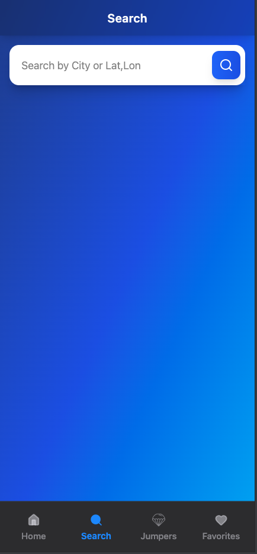
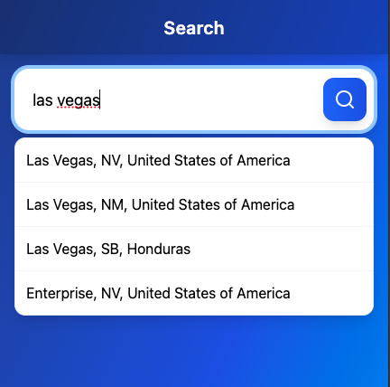
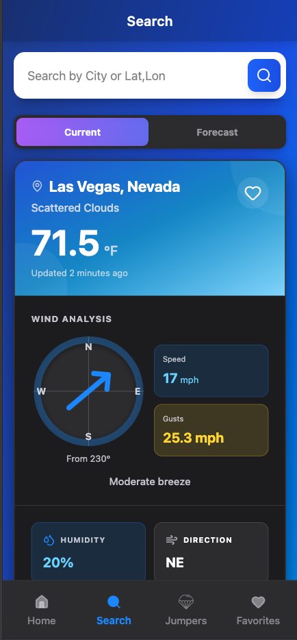

# ExitWX - Weather App for Skydivers

A full-stack weather app for skydivers and dropzone operators. 
Check real-time conditions, forecasts, and save favorite locations for quick access.

🔗 **[Live Demo](https://exitwx-fe.onrender.com/)** 

⚠️ Note: The backend may take a few seconds to respond on first load due to free hosting (cold start).

📱 Mobile-first design — optimized for smaller screens, but fully functional on desktop.

**Key Problem Solved**: Skydivers need quick access to detailed weather data for specific dropzones. This app combines location-based weather with a curated database of skydiving exits.

## 📸 Screenshots

### Search (Empty State)


<br/>

### Autocomplete


<br/>

### Weather Result



## 🎯 Project Overview

Provides wind, cloud, and forecast data for specific dropzones using a custom exit database and real-time weather APIs.

## ✨ Key Features

- **Real-time Weather Data**: Current conditions and 5-day forecasts
- **Dropzone Database**: Search from a database of skydiving exits and dropzones
- **Smart Autocomplete**: Fast search with debounced autocomplete suggestions
- **Favorites System**: Save up to 10 favorite locations with persistent storage
- **Persistent State**: Retains search results across navigation
- **Moon Phase Info**: Displays current moon phase and illumination percentage
- **Responsive Design**: Works seamlessly on desktop and mobile devices
- **Wind Analysis**: Visual compass showing wind direction with detailed metrics

## 🛠️ Tech Stack

### Frontend
- **React 18** - Hooks, Context API
- **React Router** - Client-side routing
- **Context API** - Global state management
- **Tailwind CSS** - Utility-first styling
- **Vite** - Fast build tool and dev server
- **Lucide React** - Icon library

### Backend
- **Node.js & Express** - RESTful API server
- **MongoDB & Mongoose** - Database and ODM
- **Axios** - HTTP client for external APIs
- **SunCalc** - Moon phase calculations
- **CORS** - Cross-origin resource sharing

### External APIs
- **OpenWeatherMap API** - Weather data
- **Geoapify API** - Geocoding and location search

## 🚀 How to Run Locally

### Prerequisites
- Node.js (v16 or higher)
- MongoDB (local or Atlas account)
- API Keys:
  - [OpenWeatherMap API Key](https://openweathermap.org/api)
  - [Geoapify API Key](https://www.geoapify.com/)

### Backend Setup

```bash
# Navigate to backend directory
cd backend

# Install dependencies
npm install

# Create .env file with your credentials
echo "MONGODB_URI=your_mongodb_connection_string
OPENWEATHER_API_KEY=your_openweather_api_key
GEOAPIFY_API_KEY=your_geoapify_api_key
PORT=8000" > .env

# Start the server
npm start
```

### Frontend Setup

```bash
# Navigate to frontend directory
cd frontend

# Install dependencies
npm install

# Create .env file
echo "VITE_API_URL=http://localhost:8000" > .env

# Start the development server
npm run dev
```

The app will be available at `http://localhost:5173`

## 📁 Project Structure

```
weatherapp/
├── backend/
│   ├── models/          # MongoDB schemas
│   ├── routes/          # API endpoints
│   ├── helpers/         # Utility functions
│   └── server.js        # Express server
├── frontend/
│   ├── src/
│   │   ├── components/  # Reusable React components
│   │   ├── pages/       # Page-level components
│   │   ├── context/     # Context API providers
│   │   ├── hooks/       # Custom React hooks
│   │   └── api/         # API service layer
│   └── public/
└── scraper/             # Data scraping utilities
```

## 🔮 Future Enhancements

- [ ] User authentication and profiles
- [ ] Weather alerts and notifications
- [ ] PWA support for offline access
- [ ] Unit and integration tests
- [ ] Weather radar integration

## 👤 Author

**Dan** - [GitHub Profile](https://github.com/poloblue1357) | [LinkedIn](https://www.linkedin.com/in/patterson-dan/)

---

*Built as a portfolio project to demonstrate full-stack development skills*
